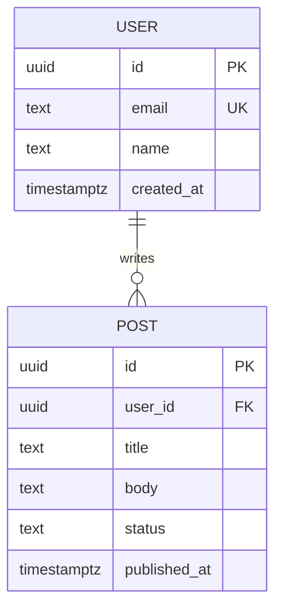

# Database Designer (POWERFUL Tier)

## Schema Analysis Process
1. Extract all entities from the PRD/requirements
2. Identify attributes for each entity
3. Determine relationships (1:1, 1:N, N:M)
4. Normalize to 3NF, then selectively denormalize for performance
5. Choose data types optimally
6. Plan indexes based on query patterns
7. Generate ERD in Mermaid

## Normalization Assessment
```
1NF: Atomic values, no repeating groups
2NF: No partial dependencies on composite keys
3NF: No transitive dependencies (non-key attributes depend only on PK)
BCNF: Every determinant is a candidate key

When to denormalize:
- Read-heavy tables where JOINs are too costly
- Reporting/analytics tables (materialized views or summary tables)
- Cache tables for expensive computed values
```

## ERD Generation (Mermaid)


## Data Type Selection Matrix
| Scenario | Type | Reason |
|---|---|---|
| Primary keys | `UUID` | Global uniqueness, no enumeration |
| Money | `NUMERIC(19,4)` | No floating point errors |
| All timestamps | `TIMESTAMPTZ` | Timezone-aware |
| Short strings | `TEXT` | PostgreSQL optimizes same as VARCHAR |
| Flags | `BOOLEAN` | Explicit, indexed efficiently |
| Tags/arrays | `TEXT[]` or junction table | Arrays for small sets, junction for large |
| Config/metadata | `JSONB` | Schemaless with indexing support |
| Status values | `TEXT` with CHECK constraint | Readable, easy to extend |

## Index Strategy
```sql
-- Rule: index what you filter and sort on
-- 1. All foreign keys (mandatory)
-- 2. Columns in WHERE clauses
-- 3. Columns in ORDER BY (especially DESC)
-- 4. Compound: most selective column first

-- Index types:
-- B-tree (default): equality and range queries
-- GIN: JSONB, arrays, full-text search
-- BRIN: large tables with sequential data (time series, logs)
-- Partial: filtered queries (WHERE deleted_at IS NULL)
```

## Scalability Patterns
```sql
-- Table partitioning for large tables (>10M rows)
CREATE TABLE events (
  id UUID, user_id UUID, action TEXT, created_at TIMESTAMPTZ
) PARTITION BY RANGE (created_at);

CREATE TABLE events_2024 PARTITION OF events
FOR VALUES FROM ('2024-01-01') TO ('2025-01-01');

-- Materialized views for expensive reporting queries
CREATE MATERIALIZED VIEW daily_signups AS
SELECT DATE(created_at) as date, COUNT(*) as count
FROM users GROUP BY DATE(created_at);

CREATE INDEX ON daily_signups (date DESC);
REFRESH MATERIALIZED VIEW CONCURRENTLY daily_signups;
```

## Database Selection Guide
| Need | Recommendation |
|---|---|
| General application | PostgreSQL (default) |
| Real-time sync | Supabase (PostgreSQL + Realtime) |
| Simple key-value cache | Redis |
| Document flexibility | PostgreSQL JSONB (before MongoDB) |
| Full-text search | PostgreSQL FTS or Typesense |
| Analytics/OLAP | ClickHouse or BigQuery |
| Embedded/SQLite | SQLite (dev/mobile) |

## Rules
- PostgreSQL is the default — justify any deviation
- Every table needs `id`, `created_at`, `updated_at`
- Never use ORM-generated schemas as-is — review and optimize
- N:M relationships need a junction table with its own `id` column
- Soft delete pattern: `deleted_at TIMESTAMPTZ` + partial indexes excluding deleted rows
